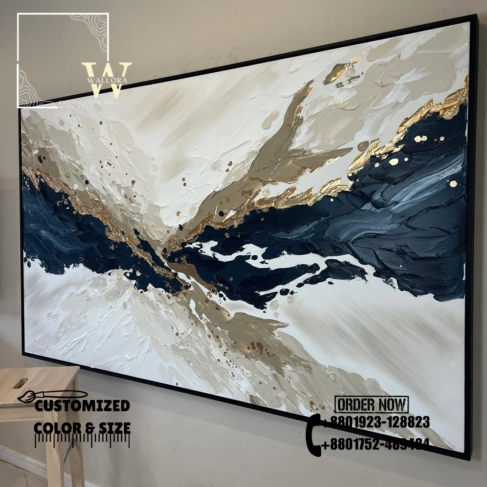

# Wallora - Custom Artwork Marketplace



Wallora is a modern, interactive marketplace for custom artwork that connects artists with art enthusiasts. This Next.js application showcases beautiful artwork with customization options, allowing customers to personalize pieces to fit their spaces perfectly.

## 🎨 Features

- **Interactive Gallery**: Browse through a curated collection of artwork with immersive parallax scrolling effects
- **Artwork Customization**: Customize artwork size, color palette, and framing options
- **Artist Showcase**: Discover talented artists and their unique stories behind each piece
- **Direct Communication**: Connect with artists directly via WhatsApp for custom orders
- **Responsive Design**: Optimized viewing experience across all devices
- **Modern UI**: Beautiful, intuitive interface with smooth animations

## 🚀 Getting Started

### Prerequisites

- Node.js 18.x or higher
- npm or yarn package manager

### Installation

1. Clone the repository
   ```bash
   git clone https://your-repository-url/art-work.git
   cd art-work
   ```

2. Install dependencies
   ```bash
   npm install
   # or
   yarn install
   ```

3. Run the development server
   ```bash
   npm run dev
   # or
   yarn dev
   ```

4. Open [http://localhost:3000](http://localhost:3000) in your browser

## 🛠️ Built With

- [Next.js](https://nextjs.org/) - React framework for production
- [React](https://reactjs.org/) - JavaScript library for building user interfaces
- [Tailwind CSS](https://tailwindcss.com/) - Utility-first CSS framework
- [Radix UI](https://www.radix-ui.com/) - Unstyled, accessible UI components
- [Lucide Icons](https://lucide.dev/) - Beautiful open-source icons

## 📱 Key Pages

- **Home Page**: Showcases featured artwork, artist information, and testimonials
- **Artwork Gallery**: Browse the complete collection with filtering options
- **Artwork Detail**: View detailed information about each piece with customization options
- **Customization Process**: Learn about the 4-step customization process
- **Contact**: Connect with the Wallora team for inquiries

## 🔄 Customization Process

1. **Choose Artwork**: Browse our collection and select your favorite piece
2. **Select Size & Color**: Customize dimensions and color palette to match your space
3. **Place Order**: Contact us via WhatsApp with your specifications
4. **Delivered with Care**: Receive your custom artwork safely packaged

## 📞 Contact

For inquiries about custom artwork or collaboration opportunities:

- WhatsApp: +8801946559679
- Email: contact@wallora.com (placeholder)
- Instagram: @wallora_art (placeholder)

## 📄 License

This project is licensed under the MIT License - see the LICENSE file for details.
